# Mapa de funciones implementadas

Referencia rápida de la superficie pública real de los módulos en `src/modules/`. Mismo propósito que
[`cad-master/docs/readme-functions.md`](../cad-master/docs/readme-functions.md) y
[`wallet/FLOWS.md`](../wallet/FLOWS.md)#13: documentar funciones ya desarrolladas, no diseño a futuro.
Sólo la clase/función principal de cada módulo está diagramada — las clases secundarias
(`InstantRunoffVoting`, `MultiDeviceRecovery`, `VerificationEconomy`, `SparseMerkleTree`) se mencionan
pero no se expanden, para mantener esto como referencia, no como spec completa.

## Índice
1. ZK Proofs — `modules/zkproof`
2. Merkle — `modules/merkle`
3. Threshold / Shamir — `modules/threshold`
4. Quadratic Voting — `modules/quadratic`
5. Runoff / IRV — `modules/runoff`
6. Delegation — `modules/delegation`
7. Verifier Incentives — `modules/incentives`
8. Analytics — `modules/analytics`
9. Recovery — `modules/recovery`

---

## ZK Proofs — `modules/zkproof`

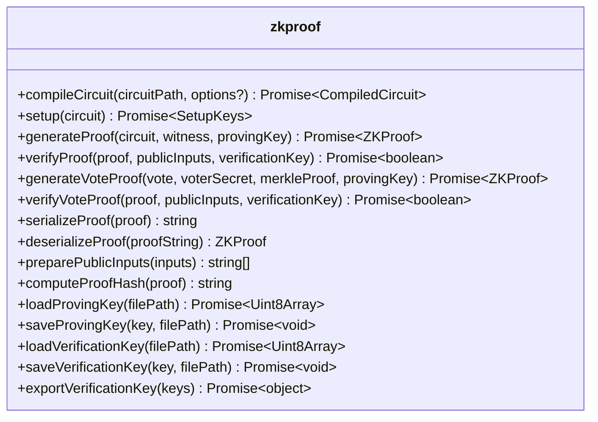

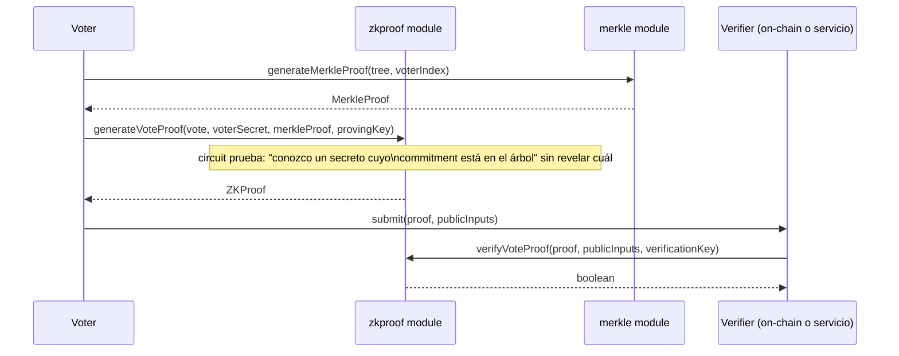

> El wallet's `BallotAdapter` (`../wallet/src/adapters/ballot-adapter.ts`) valida la *forma* de `zkProof`
> (`circuit`/`proof`/`publicInputs` presentes) pero no ejecuta `verifyProof()` — eso vive aquí, en este repo.

---

## Merkle — `modules/merkle`

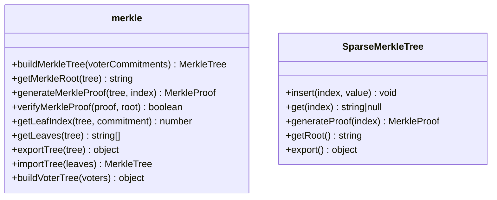

> `getMerkleRoot(tree)` es lo que el wallet's `BallotAdapter.create-ballot` espera recibir como
> `payload.merkleRoot` — este módulo es quien lo produce, el wallet solo lo transporta/ancla.

---

## Threshold / Shamir — `modules/threshold`

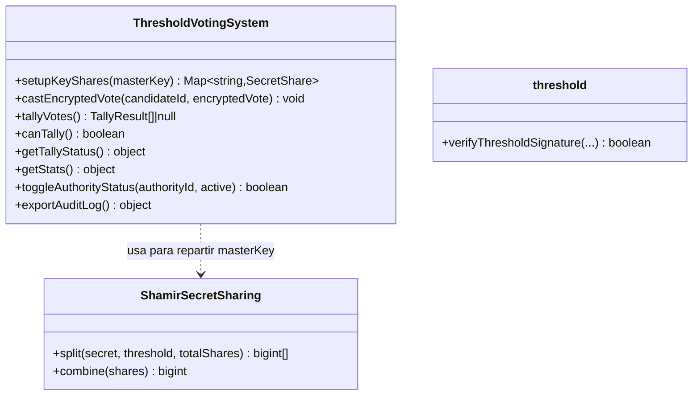

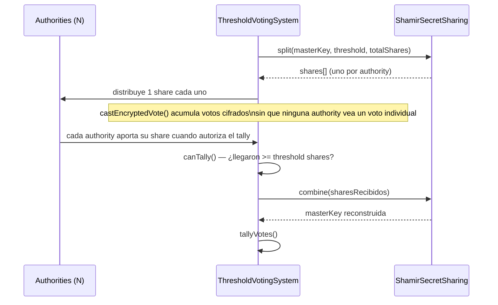

---

## Quadratic Voting — `modules/quadratic`

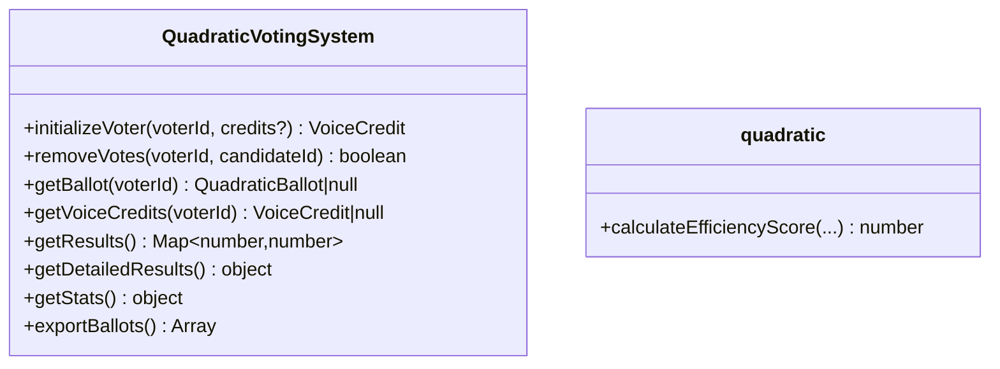

---

## Runoff / IRV — `modules/runoff`

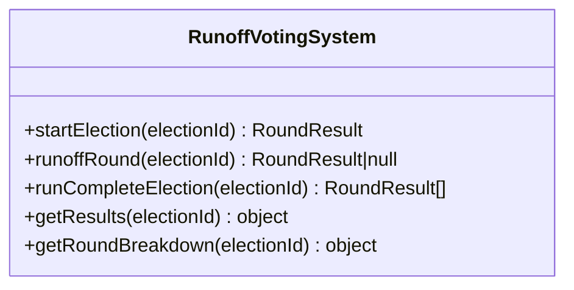

> `InstantRunoffVoting` (clase secundaria en el mismo archivo) implementa la variante de una sola
> transferencia de votos en vez de rondas eliminatorias completas — no diagramada aquí.

---

## Delegation — `modules/delegation`

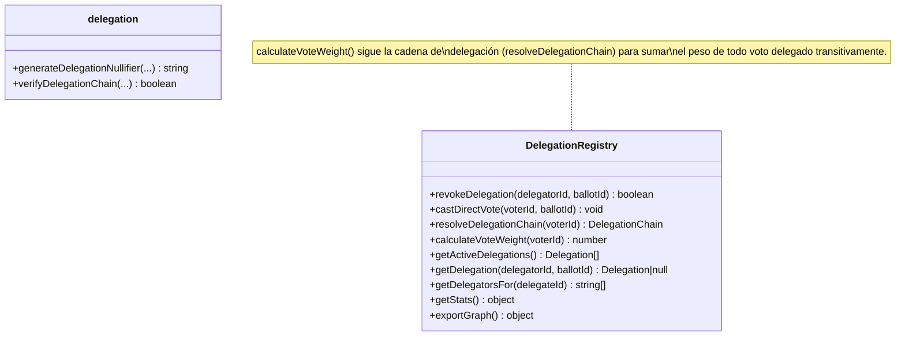

---

## Verifier Incentives — `modules/incentives`

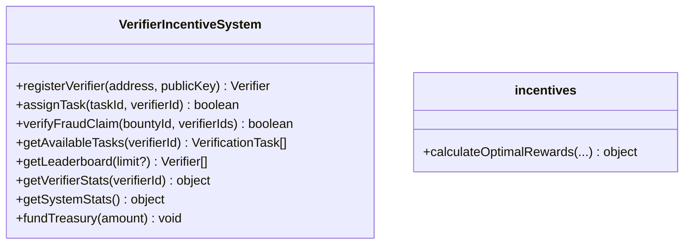

> `VerificationEconomy` (clase secundaria) modela el lado económico (treasury/recompensas) por separado
> de la asignación de tareas — no diagramada aquí.

---

## Analytics — `modules/analytics`

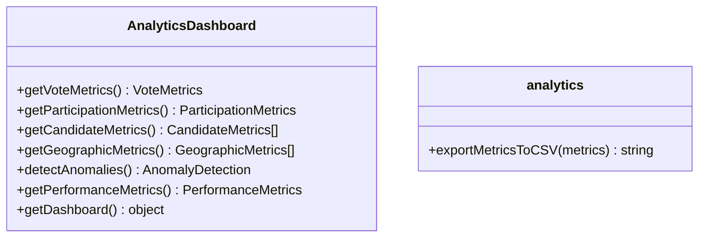

---

## Recovery — `modules/recovery`

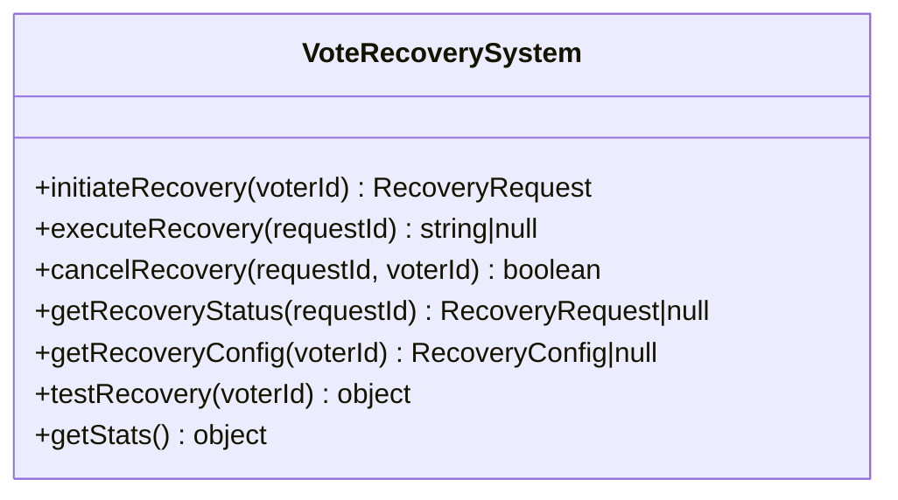

> `MultiDeviceRecovery` (clase secundaria) cubre el caso multi-dispositivo — análogo conceptual al
> sync multi-dispositivo del wallet (`../wallet/FLOWS.md`§3), pero implementado de forma independiente
> aquí; no hay integración entre ambos todavía.
